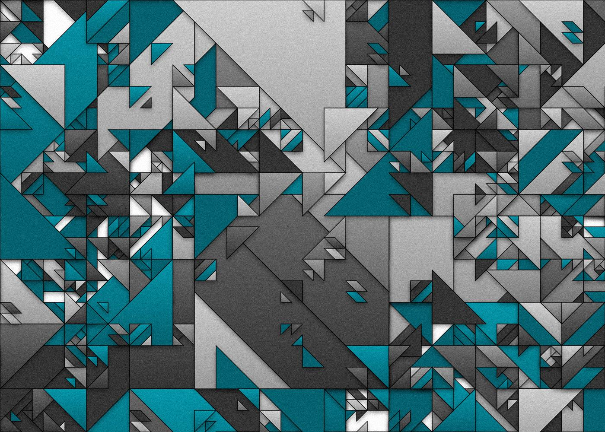

# PyGda #61

### Agenda

- Czym jest generative art
- Czym jest Processing
- Processing vs Processing.py
- Hello world w Processing.py

### Generative Art

> Generative art refers to art that in whole or in part has been created with the use of an autonomous system.

Wikipedia ([https://en.wikipedia.org/wiki/Generative_art](https://en.wikipedia.org/wiki/Generative_art))

### Przykłady

[https://www.youtube.com/watch?v=qtPi0JvmWbs](https://www.youtube.com/watch?v=qtPi0JvmWbs)

[https://www.youtube.com/watch?v=wgGsJoPdl90](https://www.youtube.com/watch?v=wgGsJoPdl90)

### Processing

> Processing is a flexible software sketchbook and a language for learning how to code within the context of the visual arts.

[Processing.org](http://processing.org) ([https://processin.org](https://processing.org/))

### Cechy

- Proste środowisko
- Dobra dokumentacja
- Dużo przykładów i materiałów
- Proste IDE

### Możliwości

- Generowanie obrazu 2D i 3D
- Analiza dzwięku np z mikrofonu
- Generowanie dzwięku
- Komunikacja MIDI (wejścia i wyjścia)
- GPIO w Raspberry Pi
- i wiele wiele innych

### Processing.py

- Moduł pythonowy
- Środowisko uruchomieniowe - Java

### DEMO

### Materiały

